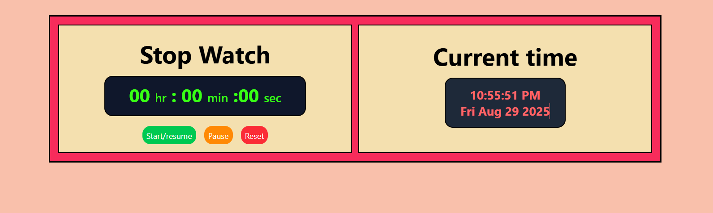

# ⏰ React + TypeScript Clock

A simple **Clock App** built with **React, TypeScript, Vite, and Tailwind CSS**.  
This app displays the current time in real-time with a clean, responsive design.

---

## 🚀 Features
- ⏱ Displays current time in real-time
- 🎨 Styled with Tailwind CSS
- ✅ Type safety with TypeScript
- 📱 Responsive design
- ⚡ Fast dev server and build using Vite

---

## 🛠️ Tech Stack
- React  
- TypeScript  
- Vite  
- Tailwind CSS  

---

## 📸 Screenshot


---


## 💻 Run Locally

Clone the repository:

```bash
git clone https://github.com/your-username/react-clock-ts.git
cd react-clock-ts
npm install npm run dev
